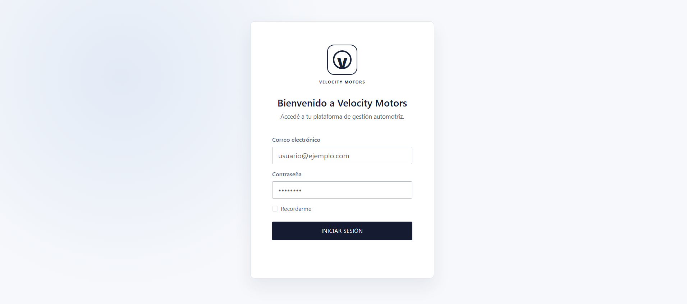
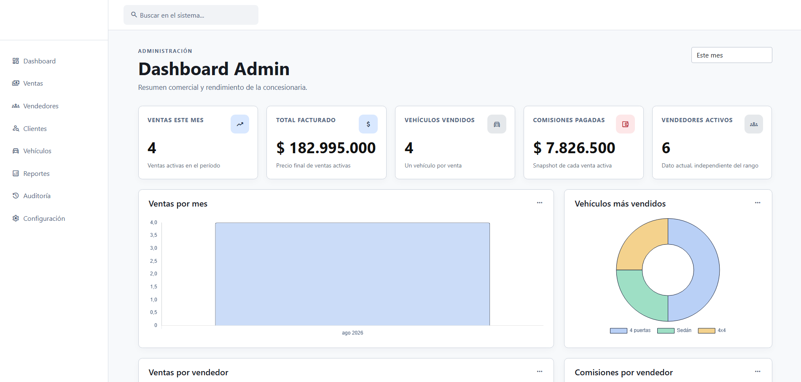
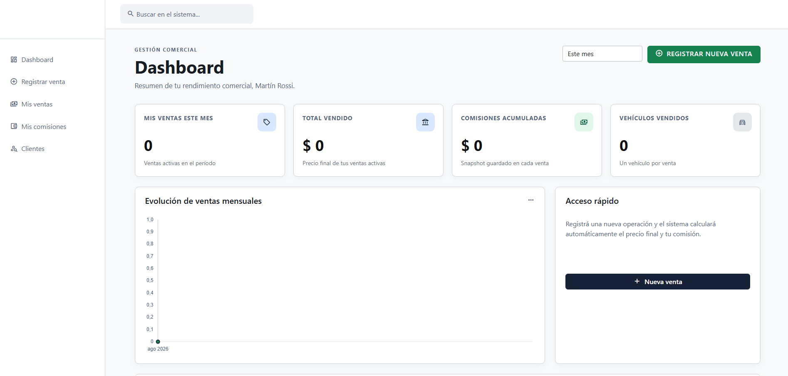
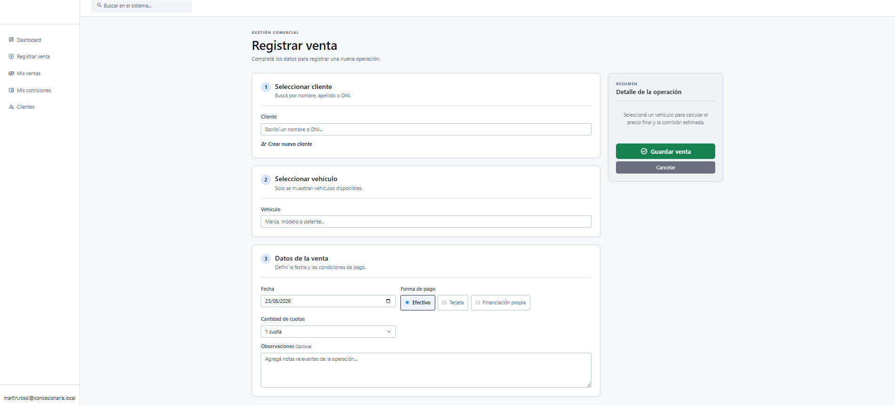
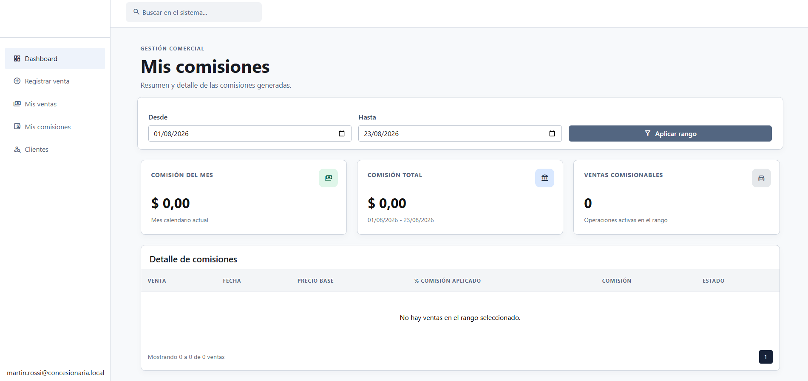
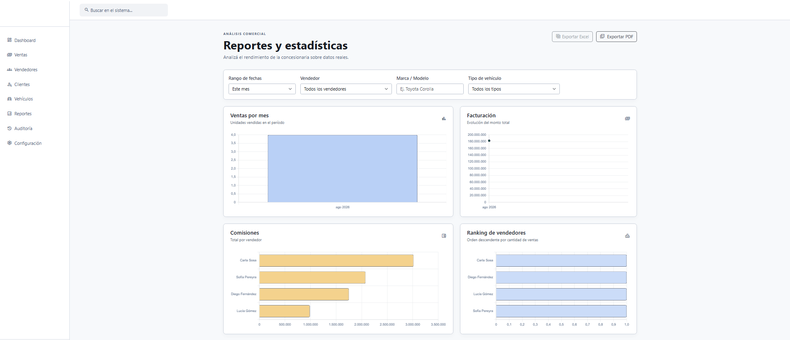
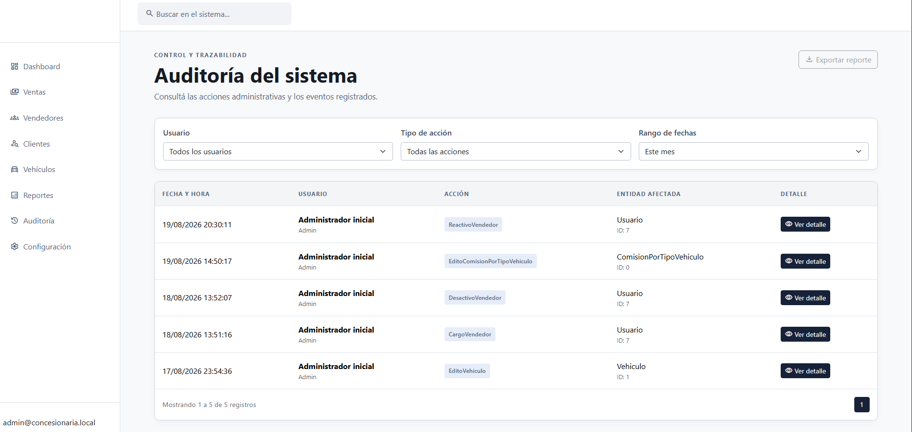

# ConcesionariaApp

Sistema web para la gestión integral de una concesionaria de automóviles nuevos y usados. La aplicación permite administrar el inventario, los clientes, los vendedores y las ventas, aplicando automáticamente las reglas de negocio para calcular precios finales y comisiones.

## Funcionalidades

- Gestión de vehículos 0 km y usados.
- Alta y edición de vendedores y clientes, conservando el historial de operaciones.
- Registro de ventas asociadas a un vehículo, cliente y vendedor.
- Cálculo automático del precio final según el método de pago y la cantidad de cuotas.
- Cálculo de comisiones según el tipo de vehículo y la antigüedad del vendedor.
- Consulta de ventas y comisiones propias para vendedores.
- Dashboard administrativo con estadísticas por período, vendedor, vehículo y cliente.
- Reportes de ventas y estadísticas.
- Anulación de ventas exclusivamente por usuarios administradores.
- Configuración editable de comisiones y recargos por cuotas.
- Registro de auditoría de las operaciones relevantes.
- Autenticación y autorización según el rol del usuario.

## Roles

### Administrador

Puede administrar vehículos y vendedores, consultar dashboards y reportes completos, configurar comisiones y recargos, consultar la auditoría y anular ventas.

### Vendedor

Puede registrar ventas, cargar y editar clientes, y consultar sus propias ventas y comisiones.

## Reglas de cálculo

La comisión se calcula sobre el precio base del vehículo:

```text
% Comisión = % base por tipo de vehículo + % adicional por antigüedad
Comisión = Precio base × (% Comisión / 100)
```

El precio final considera el recargo correspondiente a la cantidad de cuotas:

```text
Precio final = Precio base × (1 + % recargo / 100)
```

Los valores aplicados a cada venta se guardan como una copia histórica. Por lo tanto, modificar la configuración no cambia las comisiones de ventas ya registradas.

## Capturas de pantalla

### Inicio de sesión



### Dashboard del administrador



### Dashboard del vendedor



### Registro de una venta



### Comisiones del vendedor



### Reportes y estadísticas



### Auditoría



## Tecnologías

- ASP.NET Core MVC
- .NET 10
- Entity Framework Core 10
- SQL Server
- ASP.NET Core Identity
- xUnit
- Bootstrap y JavaScript

## Estructura del repositorio

```text
ConcesionariaApp/
├── .gitignore
├── ConcesionariaApp.slnx
├── README.md
├── src/
│   ├── screenshots/
│   └── ConcesionariaApp/
│       ├── Areas/
│       ├── Controllers/
│       ├── Data/
│       ├── Migrations/
│       ├── Models/
│       ├── Services/
│       ├── Tests/
│       ├── Views/
│       ├── wwwroot/
│       └── ConcesionariaApp.csproj
```

## Requisitos

- .NET SDK 10.0 o superior.
- SQL Server local o remoto.
- Git, opcional para clonar el repositorio.

## Configuración

La aplicación obtiene la cadena de conexión mediante `ConnectionStrings:DefaultConnection`. Se recomienda configurarla con User Secrets para no guardar credenciales en el repositorio:

```bash
dotnet user-secrets --project src/ConcesionariaApp/ConcesionariaApp.csproj init
dotnet user-secrets --project src/ConcesionariaApp/ConcesionariaApp.csproj set "ConnectionStrings:DefaultConnection" "Server=localhost;Database=ConcesionariaApp;Trusted_Connection=True;TrustServerCertificate=True;"
```

En un entorno de desarrollo también se puede crear el usuario administrador inicial configurando una contraseña mediante User Secrets:

```bash
dotnet user-secrets --project src/ConcesionariaApp/ConcesionariaApp.csproj set "Seeding:AdminPassword" "UnaClaveSegura123"
```

La base de datos se actualiza automáticamente mediante las migraciones de Entity Framework Core al iniciar la aplicación.

## Ejecución

Desde la raíz del repositorio:

```bash
dotnet restore ConcesionariaApp.slnx
dotnet run --project src/ConcesionariaApp/ConcesionariaApp.csproj
```

La URL de desarrollo se muestra en la consola y también está definida en `src/ConcesionariaApp/Properties/launchSettings.json`.

## Pruebas

Para ejecutar todas las pruebas automatizadas:

```bash
dotnet test src/ConcesionariaApp/Tests/ConcesionariaApp.Tests.csproj
```

Las pruebas cubren principalmente las reglas de cálculo, validación de tramos y agregación de estadísticas.

## Notas

- La base de datos local y los archivos generados por compilación están excluidos mediante `.gitignore`.
- Los métodos de pago son valores fijos de la aplicación y no se editan desde el sistema.
- Una venta anulada no devuelve automáticamente el vehículo al estado disponible; esa decisión queda a cargo del administrador.
